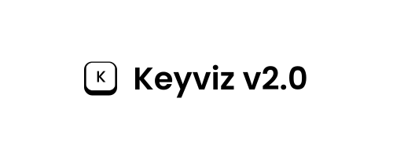
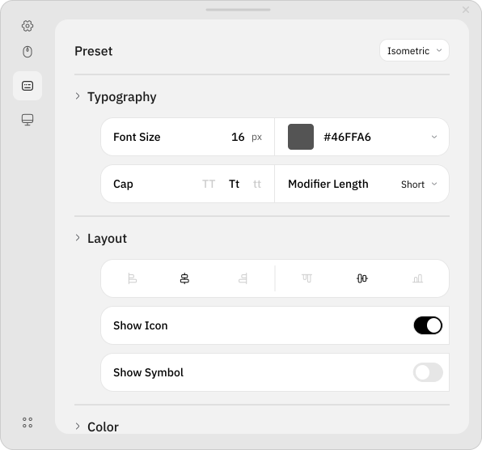

Keyviz is a free and open-source software to visualise your keystrokes and mouse actions in real time! Let your audience know what handy shortcuts/keys you're pressing during screencasts, presentations, collaborations, or whenever you need it.

**English** | [简体中文](./README_zh_CN.md)

# ⌨️ Keystrokes & 🖱️ Mouse Actions

Now you can visualize mouse actions! Not only mouse clicks, you can also visualize mouse actions along with keystrokes like <kbd>Cmd</kbd> + <kbd>Click</kbd>, <kbd>Alt</kbd> + <kbd>Drag</kbd>, etc.


# 🎨 Stylize

Don't restrain yourself to just black & white! You can customize every aspect of the visualization. The visualisation's style, size, colour (modifier and regular keys), border, icon, etc.



Powerful and easy-to-use configuration options.

- Filter normal keys and only display shortcuts like <kbd>Cmd</kbd> + <kbd>K</kbd> **(Default)**
- Adjust the visualisation position on the screen
- Decide how much the visualisation lingers on the screen before animating out
- Switch between animation presets to animate your visualisation in & out

</br>

# 📥 Installation

You can download the latest version of keyviz from the [Github Releases](https://github.com/mulaRahul/keyviz/releases) page. For the installer, unzip the downloaded file, run the installer and follow the familiar steps to install keyviz.

Below are the platform specifics options and requirements -

<details>

  <summary>🪟 Windows</summary>

  ### 🥄 Scoop
   ```bash
  scoop bucket add extras # first, add the bucket
  scoop install keyviz
  ```

  ### 📦 Winget
  ```bash
  winget install mulaRahul.Keyviz
  ```

  </br>

  <details>
  <summary><code>*.dll</code> missing error?</summary>

  If you're getting a `.dll` missing error after installing the application, you're missing the required Visual C++ redistributables. You can get the same from here [VSC++ Redist](https://learn.microsoft.com/en-us/cpp/windows/latest-supported-vc-redist?view=msvc-170).

  </details>

</details>

</br>

<details>

  <summary>🍎 MacOS</summary>

  ### 🔒 Permission
  
  Keyviz requires **Input Monitoring** and **Accessibility** permissions. Enable the same in settings -
  </br>
  ```
  Settings > Privacy & Security > Input Monitoring/Accessibility
  ```

  </br>

</details>

</br>

<details>

  <summary>🐧 Linux</summary>

  ### ❗ v2.x.x Requirements
   ```bash
  sudo apt-get install libayatana-appindicator3-dev
  ```
  or
  ```bash
  sudo apt-get install appindicator3-0.1 libappindicator3-dev
  ```

  </br>

</details>


</br>

# 🛠️ Build Instructions

You can always further develop/build the project by yourself. First of all ensure that you've setup Flutter on your system. If not follow this [guide](https://docs.flutter.dev/get-started/install).

After setting up flutter, clone the repository if you have `git` installed or download the zip and unpack the same.

```bash
mkdir keyviz
cd keyviz
git clone https://github.com/mulaRahul/keyviz.git .
```

Move inside the flutter project and run the build command to create an executable -

```bash
flutter build windows
```

</br>

# 💖 Support

As keyviz is freeware, the only way I can earn is through your generous donations. It helps free my time and work more on keyviz.
